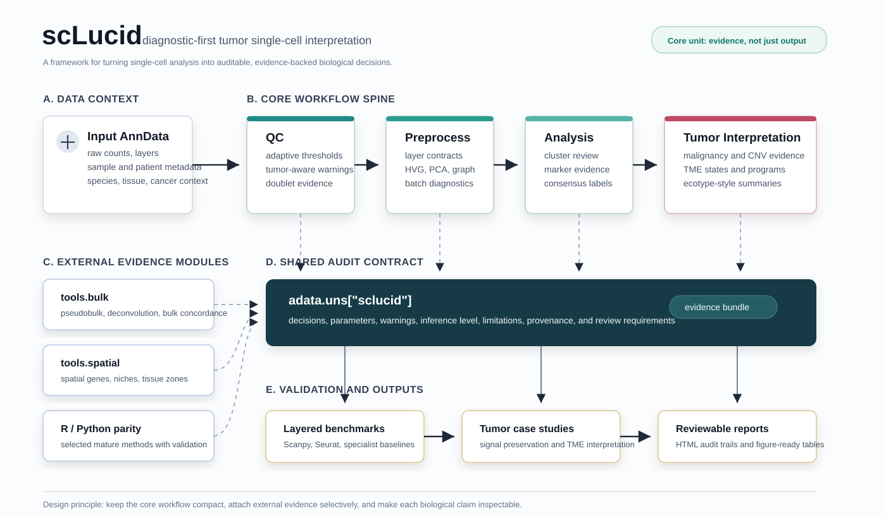

# scLucid: Lucid Tumor Single-Cell Interpretation

[](https://badge.fury.io/py/sclucid)
[](https://opensource.org/licenses/MIT)
[](https://github.com/yelu61/scLucid/actions)

**scLucid** is a diagnostic-first, audit-ready Python framework for tumor
single-cell RNA-seq interpretation. The name reflects the goal: make single-cell
analysis **lucid**: clear in its assumptions, explicit in its inference
boundaries, and reviewable from raw AnnData to biological interpretation.

scLucid is not trying to replace Scanpy, Seurat, or the broader single-cell
ecosystem. Instead, it builds a tumor-focused research system around them:
adaptive QC, conservative preprocessing, evidence-based annotation, malignancy
and TME interpretation, explicit inference semantics, and optional bulk/spatial
evidence modules.

The core idea is simple:

> Do not just run an analysis. Diagnose the data, record the evidence, state the
> inference level, and make the biological interpretation inspectable.



The framework keeps `qc -> preprocess -> analysis -> tumor interpretation` as
the core workflow spine, while bulk, spatial, and selected R/Python parity
methods act as external evidence modules that feed the same audit contract.

### What Makes scLucid Different

| Principle | What It Means In Practice |
|-----------|---------------------------|
| **Diagnostic-first** | QC, preprocessing, DE, proportion, bulk, and spatial utilities are paired with checks and warnings before results are trusted. |
| **Audit-ready by default** | Decisions, parameters, warnings, and review summaries are stored under `adata.uns["sclucid"]` and can be exported to an HTML audit report. |
| **Explicit inference semantics** | Results distinguish `sample_level`, `exploratory_cell_level`, `descriptive_sample_level`, and `exploratory_spatial` so exploratory signals are not overstated. |
| **Tumor-centered interpretation** | Annotation, CNV/malignancy evidence, TME composition, therapy signatures, spatial niches, and ecosystem/ecotype-style concepts are first-class design targets. |
| **Ecosystem-aware, not ecosystem-replacing** | Mature Python/R tools can be wrapped or validated when useful, but scLucid keeps a lightweight core and records method-specific evidence. |

### 60-Second Quickstart

From a Cell Ranger output to a clustered, annotated AnnData with a shareable HTML audit trail in four lines:

```python
import scLucid as scl

adata = scl.read_10x("path/to/filtered_feature_bc_matrix/", species="human")
adata = scl.run_pipeline(adata, dataset_type="pbmc_or_blood")
scl.export_audit_report(adata, "report.html")
```

`scl.read_10x` handles both Cell Ranger directories and `.h5` files, copies the counts to `layers["counts"]` automatically, and attaches your dataset context (species / tissue / cancer type) so downstream stages pick it up without extra arguments. For an existing `.h5ad` file, use `scl.read_h5ad` instead.

### Project Status

scLucid is in active development and is best described as an **evidence-driven
tumor single-cell workflow system in late prototype / early hardening stage**.

The package has moved beyond a collection of wrappers. It already contains
stable workflow entrypoints, AnnData contracts, review summaries, marker-resource
routing, recommendation scaffolds, real-data golden-path scripts, and targeted
tests for QC, preprocessing, analysis, tumor utilities, resources, and reporting.
The strongest modules today are QC and preprocessing: both are close to
benchmark-module maturity for auditability, reproducibility, and workflow fit.
Analysis is the active module being raised to the same standard. It now has an
evidence-first closed loop for clustering-resolution review, marker discovery,
marker-manager/CellTypist/LLM annotation evidence, consensus labels, post-hoc
QC cluster review, optional malignancy interpretation, and analysis
review-summary maturity contracts.

The current development boundary is important: scLucid can already provide a
traceable, biologically informed workflow, but it does **not** claim broad
scientific superiority over Scanpy, Seurat, scran, inferCNV, CopyKAT, CellTypist,
or other mature tools. The next stage is layered validation: prove not merely
that scLucid runs, but that its decisions are inspectable, biologically
concordant, safer in their inference claims, and convenient in real tumor
projects.

### Current Maturity Assessment

| Area | Current Level | What Works Now | Main Gaps |
|------|---------------|----------------|-----------|
| QC | Candidate benchmark module | Adaptive thresholds, tumor-aware warnings, doublet heuristics, review summaries, benchmark scaffolds | Broader real-data benchmarks and clearer user-facing threshold narratives |
| Preprocessing | Candidate benchmark module | Layer contracts, normalization/HVG/PCA/neighbors/UMAP evidence, batch-correction cautions, maturity contract | Larger multi-sample validation, stronger batch-correction recommendation evidence |
| Analysis | Second benchmark module in active hardening | `clustering_review -> markers -> annotation_evidence -> annotation_consensus -> posthoc_qc_review -> malignancy_interpretation`, manager-routed marker resources, review-summary contract | Real-data acceptance runs, richer CellTypist/reference evidence, better human-facing review tables |
| Marker Resources | Strong architectural direction | Unified `Manager`, human/mouse registry resources, tissue/tumor marker views, artifact/program/tumor routing, curation SOP | Source provenance at scale, mouse tissue/tumor parity, atlas-derived marker review |
| Tumor Module | Feature-rich but needs integration hardening | CNV, malignancy scoring/classification, TME, therapy, heterogeneity, workflow scaffolds | Consume stable analysis outputs more tightly, store tumor-stage review summaries, validate on tumor datasets |
| Plotting | Useful foundation | Publication-style themes and domain plots | Top-journal figure templates, richer multi-panel reports, visual regression checks |
| Tools / Evidence Modules | Expanding tumor support | Python-facing wrappers, bulk deconvolution, bulk/spatial clean-room utilities, R parity scaffolds | Selective method validation, dependency isolation, bulk/spatial tumor use cases |
| Documentation / Examples | Good skeleton | Three usage layers, advanced notebooks, golden-path scripts | Keep docs synchronized with maturity contracts and real-data acceptance results |

### Development Roadmap

The roadmap is intentionally staged so scLucid matures from traceable execution
to evidence-backed tumor biological usefulness.

**Phase 1 - Harden The Core QC -> Preprocess -> Analysis Path**

- Keep QC, preprocessing, and analysis as the core single-cell workflow spine.
- Use real PBMC, PDAC, and active tumor projects to harden handoff contracts:
  counts/layers, embeddings, clustering, annotation evidence, DE/proportion
  outputs, and audit summaries.
- Favor robust defaults and clear diagnostics over adding more methods.

**Phase 2 - Validate, Do Not Just Run**

- Compare against Scanpy/Seurat-style baselines at multiple layers:
  execution parity, decision quality, biological concordance, inference safety,
  and user effort.
- Convert validation into explicit acceptance criteria rather than anecdotal
  "works on my data" claims.
- Track where scLucid is better, equivalent, or weaker.

**Phase 3 - Finish Analysis As The Second Benchmark Module**

- Harden the evidence-first `run_standard_analysis` path:
  clustering-resolution evidence, marker discovery, marker-manager annotation
  evidence, optional reference/CellTypist evidence, optional data-driven LLM
  suggestion bundles, consensus labels, optional malignancy interpretation, and
  review summary.
- Keep first-pass annotation conservative: lineage / major cell type first;
  subtype and state annotation should be driven by subset reclustering or explicit
  user request.
- Route all marker-dependent analysis through `get_marker_manager()` views:
  `lineage_annotation`, `subtype_annotation`, `state_annotation`,
  `artifact_annotation`, `program_scoring`, and `tumor_interpretation`.
- Treat LLM output as annotation evidence, not ground truth.

**Phase 4 - Tumor-Aware Interpretation System**

- Keep `scLucid.tumor.malignancy.run_malignancy_interpretation` as a lightweight
  interpretation bridge, callable from the analysis workflow, that
  consumes final annotation, tumor marker evidence, optional CNV scores, optional
  malignancy signatures, and user-provided cancer context.
- Keep heavy tumor-specific algorithms in `scLucid.tumor`: CNV inference,
  malignancy scoring/classification, TME, therapy, heterogeneity, and ecosystem
  workflows.
- Separate normal epithelial annotation from malignant-cell interpretation.
- Support multiple evidence backends: lightweight CNV score, inferCNV-style
  output, CopyKAT-like calls, malignancy signatures, and manual evidence.
- Store malignant/non-malignant/suspect/unresolved calls with confidence,
  reasons, and review requirements.
- Add common high-level tumor single-cell concepts as practical APIs and plots:
  tumor programs, EMT/hypoxia/proliferation/IFN response, immune exhaustion,
  myeloid states, CAF subtypes, TME niches, tumor-stroma boundaries, therapy
  response signatures, and ecosystem/ecotype-style summaries.

**Phase 5 - Selective R/Python Parity**

- Pythonize or wrap mature R methods only when they are high-value for tumor
  single-cell work and Python lacks a strong replacement.
- Prioritize methods whose outputs can enter scLucid's evidence/audit contract:
  CNV evidence, doublet evidence, pseudobulk/sample-level inference,
  communication analysis, and selected deconvolution workflows.
- Maintain parity matrices, realistic fallbacks, and validation notebooks for
  each port or wrapper.

**Phase 6 - Resource Curation And Validation**

- Continue upgrading marker resources from “readable” to “routable,
  reviewable, source-aware”.
- Add mouse tissue/tumor marker parity after the human route stabilizes.
- Add resource validation tests for required metadata, marker symbol hygiene,
  view routing, negative markers, artifact exclusion, and tumor evidence
  isolation.
- Curate immune and tumor-state markers from pan-cancer atlases while keeping
  broad pathway signatures in gene-set JSON/GMT resources rather than concise
  annotation TOML files.

**Phase 7 - Real-Data Acceptance Gates**

- Maintain PBMC as the normal baseline.
- Maintain PDAC as the first tumor acceptance workflow.
- Add at least one second tumor type and one active research project notebook.
- Record acceptance criteria for cell retention, preprocessing readiness,
  cluster interpretability, annotation confidence, marker consistency,
  malignancy evidence, and report completeness.

**Phase 8 - Engineering, Scale, And User Experience**

- Keep imports lightweight and dependencies optional.
- Improve sparse-aware and memory-aware execution for large datasets.
- Add time/memory benchmarks against sensible Scanpy baselines.
- Convert advanced notebooks into polished, reproducible workflow narratives.
- Expand audit reports to include analysis and tumor interpretation maturity.
- Add top-journal figure templates and visual regression checks for important
  plotting functions.
- Keep beginner workflow, simple API, and advanced expert routes synchronized.

### Key Features

* **End-to-End Auditable Workflows**: High-level functions like `run_standard_qc`, `run_preprocessing`, and `run_standard_analysis` move from raw AnnData to reviewable biological evidence.
* **Diagnostic QC And Preprocessing**: Adaptive recommendations, layer contracts, tumor-aware warnings, and conservative defaults keep early decisions inspectable.
* **Evidence-Based Annotation**: Marker resources, program scoring, reference evidence, CellTypist output, and optional LLM bundles are treated as evidence, not unquestioned labels.
* **Explicit Inference Semantics**: DE, proportion, bulk, and spatial outputs state whether they are exploratory, descriptive, or valid for sample-level inference.
* **Tumor Interpretation Layer**: CNV/malignancy evidence, TME composition, therapy signatures, heterogeneity, and ecosystem/ecotype-style summaries are core research targets.
* **Bulk And Spatial Evidence Modules**: `scLucid.tools.bulk` and `scLucid.tools.spatial` provide lightweight, tumor-oriented utilities for deconvolution, bulk DE, bulk-pseudobulk concordance, spatial autocorrelation, SVGs, tissue zones, and spatial niches.
* **Selective R/Python Parity**: Mature R methods are wrapped or ported only when they add validated tumor single-cell value and can fit scLucid's audit contract.
* **Publication-Oriented Visualization**: Plotting utilities and journal font styles support reproducible figures, with richer tumor-specific visual templates planned.
* **Pydantic Configuration**: User-facing workflows use validated config objects so parameters can be serialized, inspected, and reproduced.
* **HTML Audit Reports**: `scl.export_audit_report(adata, "report.html")` renders recommendation rationale, applied thresholds, configuration lineage, and contract validation into one self-contained report.
* **Extensible Plugin Architecture**: Abstract base classes and factory patterns support custom analysis plugins without modifying core code. See [Plugin Development Guide](docs/PLUGIN_DEVELOPMENT_GUIDE.md).

### What scLucid Is Not

- It is not a claim that every scLucid result is automatically better than
  Scanpy, Seurat, or specialist tools.
- It is not a broad multi-omics platform that tries to cover every published
  method.
- It is not a black-box automated annotation engine.

scLucid's bet is narrower and more useful: make tumor single-cell workflows
clearer, safer to interpret, easier to audit, and easier to connect with bulk,
spatial, clinical, and mature ecosystem evidence.

### Choose Your Analysis Mode

scLucid offers **three user-facing layers** designed for different levels of control and expertise:

| Your Goal | Recommended Layer | Entry Point | Best For |
|-----------|-------------------|-------------|----------|
| **One-line analysis** - load data and run the full pipeline | **Workflow** | `scl.run_pipeline()` | Beginners, standard projects, reproducible pipelines |
| **Composable steps** - inspect or replace individual stages | **Simple API** | `scl.qc.calculate_qc_metric()`, `scl.pp.normalize_data()`, etc. | Analysts who need parameter control |
| **Full transparency** - every threshold, diagnostic, and override visible | **Advanced** | `examples/03_advanced_notebooks/Step1A-QC_Audit.ipynb` | Real exploratory projects, review-grade audits |

> **💡 How to choose**: If you just want results, use **Workflow**. If you need to tweak parameters, use **Simple API**. If you are doing research where every decision must be auditable, use **Advanced**.

**Examples for each layer:**
- **Workflow**: `examples/01_workflow/basic_pipeline.py`
- **Simple API**: `examples/02_simple_api/qc_step_by_step.py`
- **Advanced**: `examples/03_advanced_notebooks/Step1A-QC_Audit.ipynb` -> `Step1B-Preprocessing_Audit.ipynb` -> `Step2-Annotation_and_Malignancy.ipynb`

### Installation

The toolkit is modular. You can install the lightweight core and add extras as needed.

```bash
# Standard Installation (Core QC, Preprocessing, Analysis, and Plotting)
pip install sclucid

# To include additional analysis packages (CellTypist, cosg, etc.)
pip install "sclucid[analysis]"

# To include advanced optional tools (scVelo, infercnvpy, scVI-related workflows, etc.)
pip install "sclucid[tools]"

# To include bulk RNA-seq evidence modules (pydeseq2/gseapy-backed options)
pip install "sclucid[bulk]"

# To include spatial transcriptomics evidence modules (Squidpy/image helpers)
pip install "sclucid[spatial]"

# To install everything
pip install "sclucid[all]"
```

You can also install the latest development version directly from GitHub:
```bash
pip install "git+https://github.com/yelu61/scLucid.git"
```

For developers, clone the repository and install in editable mode:
```bash
git clone https://github.com/yelu61/scLucid.git
cd scLucid
pip install -e ".[all]"
```

On the local development machine, the maintained single-cell environment can run
the lightweight gates directly:

```bash
MAMBA_EXE=/opt/homebrew/bin/mamba \
SCLUCID_TEST_ENV_PATH=/Users/luye/micromamba/envs/scrna-env \
scripts/run_test_gates.sh
```

The first real-data workflow gate is the PBMC golden path:

```bash
/Users/luye/micromamba/envs/scrna-env/bin/python \
  scripts/run_pbmc_golden_path.py \
  --n-cells 300 \
  --output-dir results/golden/pbmc3k_subset \
  --overwrite
```

### Quick Start: A 5-Minute Analysis

Here is a minimal example of a complete workflow.

```python
import scLucid as scl

# --- 1. Load data (Cell Ranger dir, .h5, or .h5ad) ---
adata = scl.read_10x(
    "data/pbmc3k/filtered_feature_bc_matrix/",
    species="human",
    tissue="PBMC",
)

# --- 2. Run the supported core workflow ---
adata_final = scl.run_pipeline(
    adata,
    stages=["qc", "preprocess", "analysis"],
    dataset_type="pbmc_or_blood",
    show_progress=True,
)

# --- 3. Export an auditable HTML report ---
# Every threshold, parameter source, and warning is rendered into one file.
scl.export_audit_report(adata_final, "results/audit_report.html")

# --- 4. Visualize Final Results ---
# Set publication-ready font style for your target journal
from scLucid import FONT_NATURE, FONT_CELL, FONT_TRADITIONAL
scl.set_figure_params(dpi=300, font_style=FONT_NATURE)  # For Nature/Science

scl.pl.plot_embedding(adata_final, color_by="cell_type_auto", show=False)

# Save with embedded fonts for publication
import matplotlib.pyplot as plt
plt.savefig("results.pdf", dpi=600, bbox_inches="tight")
```

### Recommended Pipeline Policy

The maintained QC -> Preprocess -> Analysis path is light by default and
optionally extensible:

- QC uses Python-native metrics, adaptive recommendations, conservative
  multi-criterion filtering, and optional Scrublet/heuristic doublet evidence.
- Preprocessing preserves counts, filters low-detection genes, runs standard
  log-normalization, uses dependency-light HVG selection, then PCA/neighbors/UMAP.
  Regression and batch correction are explicit opt-ins.
- Analysis consumes the unambiguous layers and embeddings from preprocessing for
  clustering review, marker/evidence tables, annotation consensus, DE, and
  proportion summaries. Analysis also records post-hoc QC review evidence for
  doublet-heavy, high-mitochondrial, or stress-high clusters without deleting
  cells automatically.
- Optional enhancements such as `scanpy.external.pp.scran_normalize`,
  `seurat_v3` HVGs, Harmony, scVI/scANVI, BBKNN, SOLO, or DoubletDetection are
  available when their dependencies and biological rationale are present.

ScDblFinder wrappers, project-level ambient RNA correction, and custom rpy2
execution branches are not part of the recommended default path.

### Documentation

For detailed tutorials, how-to guides, and the full API reference:

* **Plugin Development**: [Plugin Development Guide](docs/PLUGIN_DEVELOPMENT_GUIDE.md) - Create custom analysis plugins
* **R Parity Matrix**: [docs/source/r_parity.rst](docs/source/r_parity.rst) - What each R-package port (BayesPrism, Monocle3, CellChat, DWLS) covers vs the R original
* **Naming Conventions**: [Naming Conventions](docs/NAMING_CONVENTIONS.md) - Code style guidelines
* **Local Documentation Source**: [docs/source/](docs/source/) - Sphinx documentation sources for installation, quickstart, API references, and best practices
* **Core Data Contracts**: [docs/source/data_contracts.rst](docs/source/data_contracts.rst) - Stable AnnData and review-summary conventions shared across workflow stages
* **Analysis API**: [docs/source/api/analysis.rst](docs/source/api/analysis.rst) - Analysis review contract, annotation evidence, DE, enrichment, and proportion APIs
* **Tumor API**: [docs/source/api/tumor.rst](docs/source/api/tumor.rst) - Tumor CNV and malignancy interpretation APIs
* **Workflow Hardening Plan**: [docs/source/workflow_hardening.rst](docs/source/workflow_hardening.rst) - Real-data vertical-slice plan for PBMC, PDAC, and active project validation
* **PBMC Golden Path**: [scripts/run_pbmc_golden_path.py](scripts/run_pbmc_golden_path.py) - Runnable real-data baseline that emits a manifest, final `.h5ad`, and inspection figures
* **Analysis Acceptance Runner**: [scripts/run_analysis_acceptance.py](scripts/run_analysis_acceptance.py) - Runnable Step2 analysis hardening path for clustering review, annotation evidence, consensus labels, and optional malignancy interpretation

For quick examples, see the `examples/` directory.

### Contributing

We welcome contributions from the community! If you'd like to contribute, please check out our [Contributing Guidelines](CONTRIBUTING.md) and the issue tracker.

### License

`scLucid` is licensed under the MIT License.

### How to Cite

If you use `scLucid` in your research before a formal methods paper is available,
please cite the GitHub repository and include the package version used in your
analysis. A manuscript citation will be added once available.
