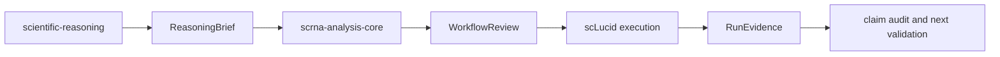

# Scientific Reasoning Contracts

Status: P0 documentation contract, `0.1-draft`.

This page defines how portable scientific-reasoning skills can exchange intent
and evidence with scLucid without changing the current public Python API. The
objects below are planned contracts, not implemented scLucid classes.

## Why This Layer Exists

`ProjectContext` records dataset and study metadata. `AnalysisPlan` records
workflow decisions. `RunReview` summarizes evidence already produced by
scLucid. None of these objects should be overloaded with a complete causal
hypothesis, evidence ladder, or clinical claim.

The P0 contract keeps those responsibilities separate:



## Contract Ownership

| Object | Producer | Responsibility |
| --- | --- | --- |
| `ReasoningBrief` | scientific reasoning | question, estimand, hypotheses, required evidence, alternatives, falsifiers, validation, claim boundary |
| `WorkflowReview` | workflow reviewer | feasibility, stage gates, parameter decisions, diagnostics, result-reading guidance, rerun scope |
| `RunEvidence` | scLucid or another executor | executed method, artifact, result, uncertainty, sensitivity, provenance, evidence status |

A downstream layer may reject or qualify an upstream request, but it must not
silently redefine the scientific question or strengthen the requested claim.

## ReasoningBrief

Required conceptual fields:

```yaml
schema_name: ReasoningBrief
schema_version: 0.1-draft
question_id: Q1
decision_to_inform: null
primary_question: null
context: {}
estimand:
  population: null
  exposure_or_intervention: null
  comparator: null
  outcome: null
  time_frame: null
  experimental_unit: null
design: {}
mechanism_hypotheses: []
required_evidence: []
assumptions: []
alternative_explanations: []
falsifiers: []
validation_ladder: []
claim_boundary:
  supported: []
  exploratory: []
  unsupported: []
smallest_decisive_next_step: null
```

`ReasoningBrief` is scientific intent. It does not select Scanpy, scVI, QC,
integration, clustering, or statistical parameters.

## WorkflowReview

Required conceptual fields:

```yaml
schema_name: WorkflowReview
schema_version: 0.1-draft
review_id: WR1
question_id: Q1
input_reasoning_version: 0.1-draft
overall_status: REVIEW
evidence_coverage: []
stages: []
parameter_decisions: []
results_guide: []
claim_boundary: {}
blockers: []
assumptions: []
prioritized_actions: []
missing_evidence: []
```

`WorkflowReview` determines whether the design and available scRNA-seq
artifacts can generate each requested evidence item. It is a plan or audit, not
evidence that an analysis was run.

## RunEvidence

Required conceptual fields:

```yaml
schema_name: RunEvidence
schema_version: 0.1-draft
evidence_id: E1
question_id: Q1
run_id: null
stage: null
artifact: {}
method:
  name: null
  version: null
  parameters: {}
result:
  summary: null
  effect: null
  uncertainty: null
  experimental_unit: null
sensitivity: []
quality_status: REVIEW
supports: []
challenges: []
limitations: []
```

`RunEvidence` records an executed observation. Scientific reasoning still owns
the later claim audit and must consider alternative explanations and missing
links in the causal chain.

## Mapping To Current scLucid

| Scientific field | Current scLucid surface |
| --- | --- |
| assay | `ProjectContext.assay` |
| tissue or system | `ProjectContext.tissue`, `tissue_type`, `dataset_type` |
| cancer context | `ProjectContext.cancer_type` |
| short objective | `ProjectContext.study_objective` |
| biological sample | `ProjectContext.sample_key` |
| technical batch | `ProjectContext.batch_key` |
| comparison | `ProjectContext.condition_key` |
| experimental unit | `ProjectContext.experimental_unit_key` |
| paired or repeated unit | `ProjectContext.paired_key` |
| planned workflow decisions | `AnalysisPlan` and `DecisionCard` |
| executed cross-stage review | `RunReview` and module review summaries |

Do not store the entire `ReasoningBrief` in `study_objective`. Until a versioned
implementation exists, keep the full brief as a project-side artifact and pass
only current supported metadata into `ProjectContext`.

## Frozen Analysis Metadata Propagation Matrix

For proportion and pseudobulk inference, field names and statistical roles are
separate contracts. `AnalysisPlan.context` preserves the resolved
`ProjectContext`, while its `sample_level_inference` decision records the
condition, experimental unit, pairing, and observed replicate counts. Execution
must resolve the following matrix without substituting a hard-coded column name:

| Project context | Analysis execution | Proportion config | Pseudobulk config | Statistical role | Fail-closed rule |
| --- | --- | --- | --- | --- | --- |
| `sample_key` | `sample_col` | `sample_col` | `sample_col` | one aggregate observation | each value maps to exactly one condition and one experimental unit |
| `condition_key` | `condition_col` | `condition_col` | `condition_key` | comparison factor | at least two observed levels; every requested contrast level exists |
| `experimental_unit_key` | `experimental_unit_col` | `experimental_unit_col` | `experimental_unit_col` | independent biological replicate | replicate counts use unique units, never cells or technical rows |
| `paired_key` | `pairing_col` / `block_col` | `pairing_col` | `block_col` | repeated-measures identity | a repeated unit across conditions requires an explicit paired/block design |
| `batch_key` | explicit review candidate | `batch_col` | `design_covariates` | technical adjustment candidate | never auto-apply; reject ignored, constant, confounded, or rank-deficient covariates |
| `cell_type_key` | resolved annotation key | `celltype_col` | `groupby` | analysis stratum | labels must be present and non-empty for the cells being analyzed |

`sample_key` does not necessarily mean independent replicate. When a source
column is a capture or library label shared by several donors, derive an
aggregation identifier such as `donor + condition`, record that derivation in
the evidence artifact, and retain `donor` as the experimental unit. Multiple
technical samples for the same experimental-unit/condition pair must be
consolidated explicitly before inference.

The execution audit is stored in
`adata.uns["sclucid"]["proportion"]["design"]` and
`adata.uns["sclucid"]["analysis"]["de"]["<key>_design"]`. A result is not
publication-valid merely because a model returned rows: the design must be
identifiable, biological replication must be sufficient, and the row-level
p-value must be finite.

## Compatibility Rules

1. Existing workflows must remain valid without a `ReasoningBrief`.
2. Preserve `question_id` and `evidence_id` across handoffs.
3. Use explicit missing values; never invent required evidence.
4. Treat `BLOCKED`, `REVIEW`, `READY`, and `NOT_RUN` as use-specific states.
5. A planned analysis is not `RunEvidence`.
6. An executed association is not automatically a mechanism or clinical claim.
7. Promote these contracts to code only after real-project, serialization, and
   backward-compatibility tests.

## Implementation Gate

Before adding public Pydantic models or new arguments to `plan_analysis()` and
`review_run()`:

- complete at least two distinct real-project handoffs;
- show that stable IDs survive planning, execution, and reporting;
- define storage outside and, later, inside `adata.uns["sclucid"]`;
- add round-trip serialization tests;
- demonstrate that existing calls remain unchanged;
- decide which fields are public API versus report-only evidence.

P0 is complete when the semantics are stable enough for real-project testing;
it is not a commitment to implement the draft unchanged.
